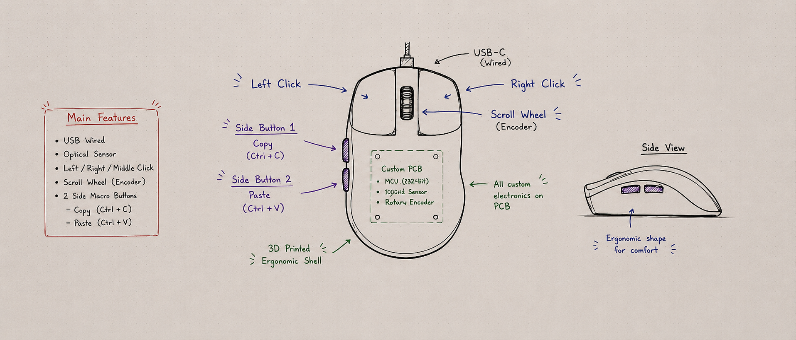

# DevMouse

DevMouse is a custom 3D printed productivity mouse designed for programmers.

The mouse will use a custom PCB, USB HID microcontroller, optical sensor, scroll wheel encoder, left/right/middle click buttons, and two side macro buttons for copy and paste.

## Planned Features

- Custom PCB
- Wired USB connection
- Optical mouse sensor
- Left, right, and middle click
- Scroll wheel encoder
- Two side macro buttons
  - Copy: Ctrl + C
  - Paste: Ctrl + V
- 3D printed ergonomic shell

## Project Goal

The goal is to build a complete custom USB mouse instead of modifying an existing mouse. This project combines PCB design, firmware, CAD, and 3D printing.

## Bill of Materials

| Part | Quantity | Purpose | Estimated Cost |
|---|---:|---|---:|
| RP2040 microcontroller board/chip | 1 | USB HID controller for mouse movement and shortcuts | $10 CAD |
| Optical mouse sensor/module | 1 | Detects mouse movement | $30 CAD |
| Scroll wheel encoder | 1 | Scroll wheel input | $5 CAD |
| Mouse switches | 3 | Left, right, and middle click | $10 CAD |
| Tactile side buttons | 2 | Copy and paste macro buttons | $3 CAD |
| USB-C connector/breakout | 1 | Wired USB connection | $3 CAD |
| Custom PCB | 1 order | Holds electronics and wiring | $25 CAD |
| Screws / heat-set inserts | Several | Assembly hardware | $6 CAD |
| 3D printer filament | Small amount | Printed ergonomic shell | $5 CAD |
| **Total** |  |  | **$97 CAD** |

## Current Status

Planning stage. I have decided the main features and created the first concept sketch.
